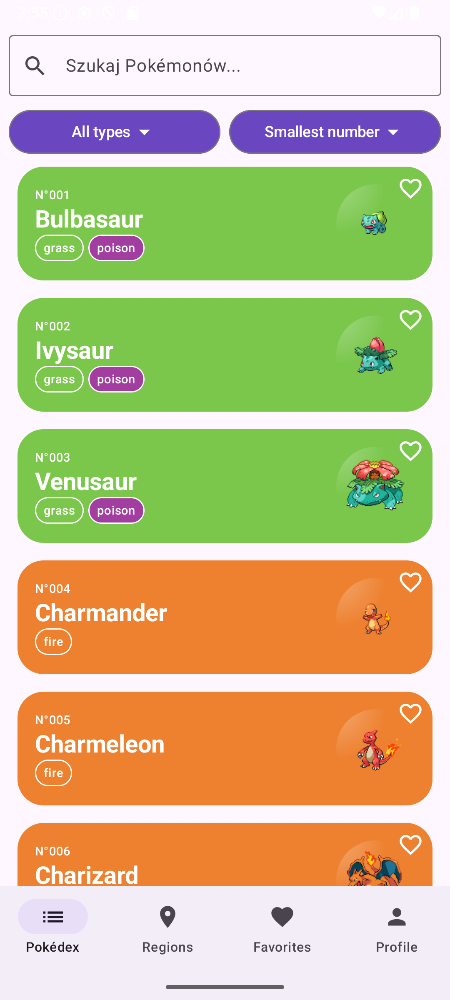
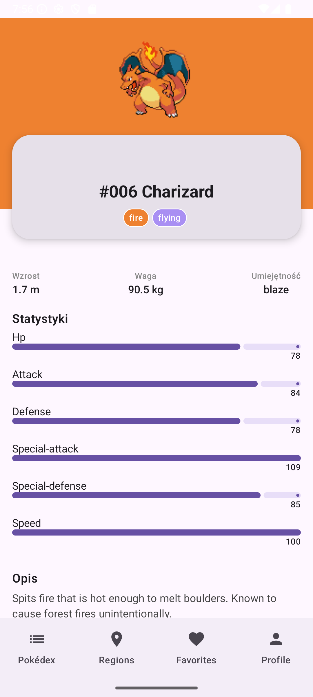

# 📱 PokeApp

**PokeApp** to aplikacja Android stworzona w Kotlinie, umożliwiająca przeglądanie listy Pokémonów wraz ze szczegółami, ewolucjami oraz regionami występowania. Dane pobierane są z zewnętrznego API i zapisywane lokalnie w bazie danych.

---

## 🧰 Użyte biblioteki

- **Retrofit** – do obsługi zapytań HTTP do API Pokémonów.
- **Room** – lokalna baza danych SQLite z dostępem poprzez DAO.
- **Kotlin Coroutines** – obsługa operacji asynchronicznych.
- **ViewModel & LiveData** – do zarządzania stanem UI i logiką prezentacji.
- **Gradle Kotlin DSL** – konfiguracja projektu.

---

## 🧩 Struktura i relacje bazy danych

Baza danych lokalna została zaimplementowana z użyciem Room. Oto główna encja:

### PokemonEntity.kt

```kotlin
@Entity(tableName = "pokemon")
data class PokemonEntity(
    @PrimaryKey val id: Int,
    val name: String,
    val imageUrl: String,
    val types: String
)
```

### PokemonDao.kt

Zawiera operacje CRUD:
- `insertPokemon(pokemon: List<PokemonEntity>)`
- `getAllPokemon(): Flow<List<PokemonEntity>>`
- `deleteAll()`

---

## 🔀 Nawigacja w aplikacji

Nawigacja w aplikacji oparta jest na `MainActivity` i architekturze MVVM:

- **MainActivity.kt** – główny punkt wejścia aplikacji.
- **PokemonViewModel.kt** – zarządza logiką listy Pokémonów.
- **PokemonViewModelFactory.kt** – tworzy instancje ViewModeli.
- **Ekrany prezentowane przez aplikację**:
  - Lista Pokémonów
  - Szczegóły Pokémona
  - Łańcuch ewolucji
  - Regiony

---

## 🚀 Uruchomienie projektu

1. Sklonuj repozytorium:
   ```bash
   git clone https://github.com/twoj-login/PokeApp.git
   ```
2. Otwórz projekt w Android Studio.
3. Uruchom na emulatorze lub fizycznym urządzeniu z Androidem.

---

## 🧪 Testowanie

Projekt zawiera testy instrumentacyjne w `androidTest`. Można je uruchomić z poziomu Android Studio lub komendą Gradle.

---

## 🛠 Znane problemy

- Brak pełnego zarządzania błędami przy braku Internetu.
- Ewolucje Pokémonów mogą czasem nie ładować się poprawnie przy złożonych łańcuchach.

---

## 📸 Screeny

<table>
  <tr>
    <td></td>
    <td></td>
  </tr>
  <tr>
    <td style="text-align:center">Lista Pokémonów</td>
    <td style="text-align:center">Szczegóły Pokémona</td>
  </tr>
</table>

---

## 🎨 Figma

https://www.figma.com/proto/5BlPH6gN8IFxU3SNK8Id5F/Pokedex-App?page-id=2%3A777&node-id=8-1640&viewport=1378%2C-126%2C0.89&t=sgC5Mx6eqCL7QHsF-1&scaling=min-zoom&content-scaling=fixed

---

## 📄 Licencja

Projekt stworzony do celów edukacyjnych.
